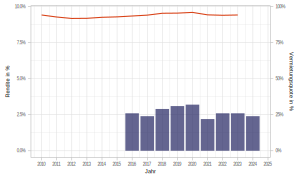
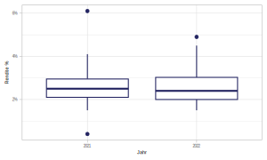

class: title-slide

```{r xaringan-themer, include=FALSE}
library(xaringanthemer)
style_xaringan(text_color = "#232461",inverse_text_color = "#FFFFFF",inverse_background_color = "#232461", title_slide_background_color = "#232461",header_background_color = "#232461",header_color = "#FFFFFF",header_h1_font_size = "32px",
  header_h2_font_size = "26px",link_color="#d84116",
  header_h3_font_size = "20px",text_slide_number_color = "#232461",text_slide_number_font_size = "0.5em")
```

```{r xaringanExtra, echo=FALSE}
xaringanExtra::use_progress_bar(color = "#d84116", location = "bottom")
xaringanExtra::use_xaringan_extra(c("tile_view","scribble","panelset","tachyons"))
xaringanExtra::style_panelset_tabs(font_family = "inherit")
#xaringanExtra::use_search(show_icon = TRUE)
#weitere: "share_again","animate_css", "webcam","freezeframe","clipboard","fit_screen","extra-styles" 
xaringanExtra::use_editable(expires = 1)
xaringanExtra::use_freezeframe(trigger = "hover")
```


```{r setup, include=FALSE}
options(htmltools.dir.version = FALSE)
library(fontawesome)
```


# Europäische Immobilien-Investmentmärkte

## Aktuelle Entwicklungen, langfristige Trends und Projektideen

### ZHAW Winterthur am 27.05.2023 
<br>
<br>
<br>
<br>
<br>
<br>
<br>
<br>
### Prof. Dr. Jörg Schoder
<br>
.mycontacts[
`r fa('github')` @Schoder
`r fa('linkedin')` @jfschoder
]


---
name: ewigeRente
class: left

# Bewertungseffekte von Zinsanstiegen

```{r ewigerente, echo=FALSE,out.width='100%',fig.align='center'}
knitr::include_graphics(xfun::from_root("img/zinssensitiv.svg"))
```


---
name: CREfunds
class: left

# Zunehmende Bedeutung von Investmentfonds...

...in den europäischen Immobilieninvestmentmärkten.

.panelset[
.panel[.panel-name[Zunahme...]
...des Anteils von Immobilien-Investmentfonds in Gewerbeimmobilienmärkten der Eurozone. Angaben in %:
```{r reiftime,echo=FALSE,out.width='100%',fig.align='center',cache=TRUE}
knitr::include_graphics('../img/Anteile_Investmentfonds_in_CRE_Europe_(EZB).png')
```

.quellePanURL[Quelle: [EZB (2023)](https://www.ecb.europa.eu/pub/financial-stability/macroprudential-bulletin/html/ecb.mpbu202304_1~4a07638376.en.html).]
]
.panel[.panel-name[Varianz...]
...im Ländervergleich (in % der nationalen Gewerbeimmobilienmärkte)
```{r reifnat,echo=FALSE,out.width='100%',fig.align='center',cache=TRUE}
knitr::include_graphics('../img/Anteile_Investmentfonds_in_CRE_countries_(EZB).png')
```
.quellePanURL[Quelle: [EZB (2023)](https://www.ecb.europa.eu/pub/financial-stability/macroprudential-bulletin/html/ecb.mpbu202304_1~4a07638376.en.html).]
]
]


---
name: OIFretlet
class: left

# Offene Immobilienfonds


.panelset[
.panel[.panel-name[Durchschnittswerte]
```{r OIFretlet,echo=FALSE,out.width='100%',fig.align='center',cache=TRUE}

```

.quellePanURL[Eigene Darstellung. Datenquelle: [Scope (2023)](https://www.scopegroup.com/dam/jcr:b461c4db-421f-4ebd-bead-e3668875f5c9/Scope%20Renditekennzahlen%20Offene%20Immobilienfonds%20Mai%202023.pdf).]
]
.panel[.panel-name[Verteilung]
```{r OIFretdis,echo=FALSE,out.width='100%',fig.align='center',cache=TRUE}

```
.quellePanURL[Eigene Darstellung. Datenquelle: [Scope (2023)](https://www.scopegroup.com/dam/jcr:5d0634bc-c9a8-4307-a34a-582c0c682747/Scope%20Markanalyse%20Offene%20Immobilienfonds%20M%C3%A4rz%202023.pdf).]
]
]


---
name: EPBD
class: left

# Novellierung der EU-Richtlinie  (EPBD)


???

* EU-Richtlinie über die Gesamtenergieeffizienz von Gebäuden (Energy Performance of Buildings Directive, EPBD)
* Aktuell plant die EU eine Novellierung der Energy performance of buildings directive (EBPD), die noch dieses Jahr finalisiert werden soll. Noch fehlen Ausformulierungen der technischen Anforderungen zu den übrigen vier von sechs Umweltzielen im Rahmen der Taxonomieverordnung; was möglicherweise zu einer Verschiebung auf Ende 2023 bzw. Anfang 2024 führt. Besonders das vierte Umweltziel **"Übergang zu einer Kreislaufwirtschaft" wird Projektentwickler und Bauunternehmen vor neue**, besonders anspruchsvolle **Herausforderungen stellen**. [Colliers (2023)](https://citysurvey.colliers.de/makrookonomisches-umfeld/)


* Ein erster Meilenstein war die EPBD 2010: verpflichtung der Mitgliedsländer zur Setzung von Mindeststandards
  * Forschung seither vielfach auf Basis von **Normgebäuden und Einzelfallanalysen**. [Hummel et al. (2023)](): "Often, a remarkable number of refurbishment and heating system change options are also considered. At the same time, **taking into account resource restrictions as well as interactions in the entire energy system is not possible at this analysis level**. Therefore, it is not possible to upscale the results of the cost-optimality calculations for single buildings or building types to the national or EU level to understand cost-optimal saving levels (vgl. [Hummel et al](https://link.springer.com/article/10.1007/s12053-023-10097-6)).
  * Studien auf **Stadt- oder Regionalebene** mit Einbeziehung von **Fernwärmenetzen** (disrict heating)
  * "Henning and Palzer (2014) developed the REMod-D model for optimising energy systems at the national level. [..] [T]hey conclude that ambitious levels of heat savings in building retrofitting will be needed to reach 100% renewable energy in heat and electricity use, considering that full exploitation of technical resource potentials will most probably not be possible."


---
name: ESGMotive
class: left

# Unterschiedliche Gründe für Bedeutungszunahme von ESG

.panelset[
.panel[.panel-name[Bedeutung]

Zunehmende Bedeutung von ESG für Investoren und Nutzer in 2022:

```{r,echo=FALSE,out.width='70%',fig.align='center'}
knitr::include_graphics('../img/ESG_2022_wichtiger_(CBRE_2023)_S7.png')
```
]
.panel[.panel-name[Motive]

Unterschiedliche Motive für zunehmende Berücksichtigung von ESG:

```{r,echo=FALSE,out.width='70%',fig.align='center'}
knitr::include_graphics('../img/ESG_Motive_NutzerInvestoren_(CBRE_2023)_S7.png')
```
]
]

.quelle[Quelle: [CBRE (2023, S.7)](https://www.cbre.com/-/media/project/cbre/shared-site/insights/books/2023-book-media-folder/esg-value-drivers-revealed-media-folder/2022_global_esg_survey.pdf).]


